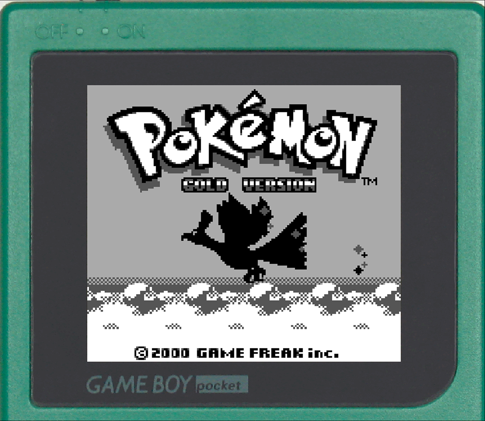
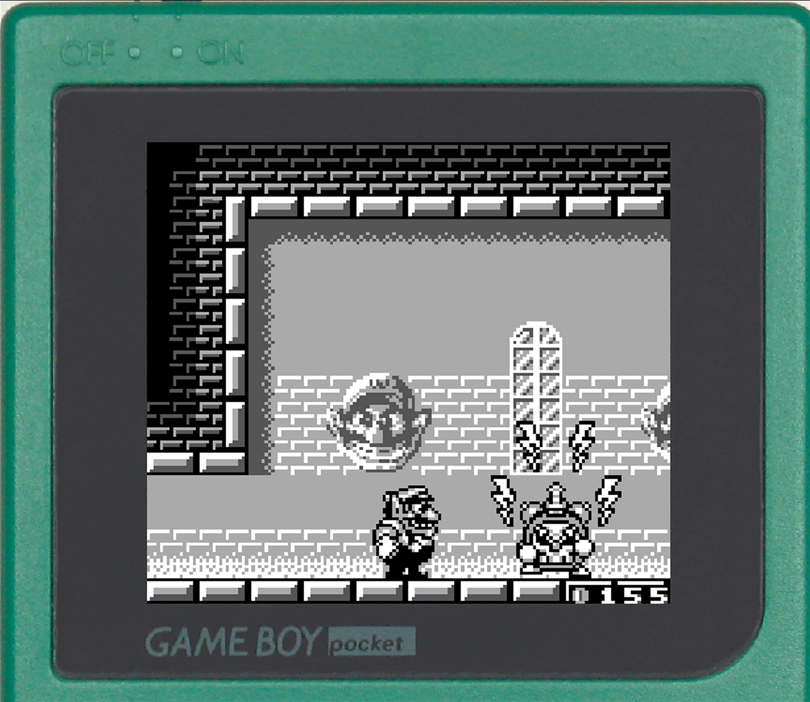
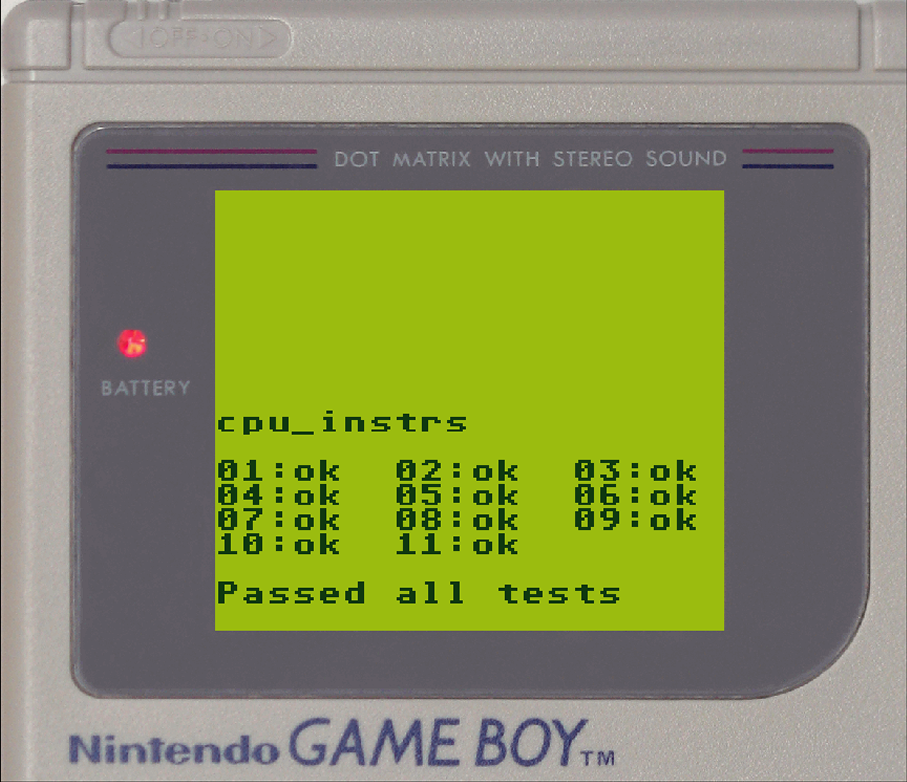
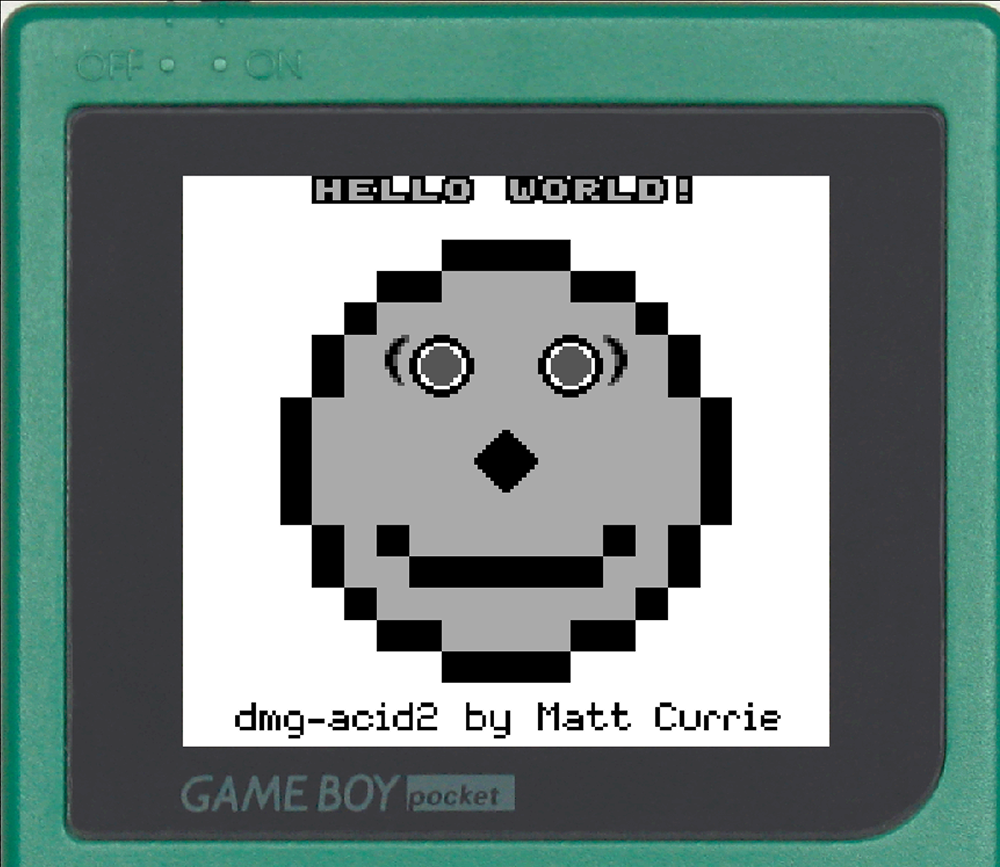

# admge
A simple and (I like to think) lightweight emulator for the original GameBoy in C.

This was started as a way to play a specific game and has reached a baseline level. From here on, the project will only get intermittent updates depending on my free time.

## Showcase

<p align="center">
  
  
</p>

<p align="center">
  
  
</p>

<p align="center">
  
  
</p>

## Controls

| Game Boy | Keyboard |
| :--- | :--- |
| **D-Pad** | `Arrow Keys` |
| **A** | `Z` |
| **B** | `X` |
| **Start** | `Enter` |
| **Select** | `Any Shift` |
| Mute | `M` |
| Quit | `Q` |


## Issues:

The emulator is only minimally accurate, some games do not work perfectly, and may have minor issues. However, all blaarg tests pass, so it should support most games.

It isn't completely cycle accurate (The cycles get added after the instructions are carried out).

Note: I'm relying on Vsync to limit the framerate. While untested, this should break on monitors with refresh rate above 60Hz.  
What if you've disabled VSync for your graphics driver? Well, enjoy the raw speed of your CPU then :D

For now just use VSync with a 60Hz refresh rate  


If you do encounter any isssues, feel free to contact me with feedback.

## Get it to Work
### Specific Dependencies are: 
- SDL2
- SDL_Image
- tinyfileldialogs
- Dear ImGUI

of these, SDL2 and SDL_Image are not bundled, install it for your system.
then, use flag -libsdl2 when compiling. However due to how messy the directory is, I recommend using the provided makefile

```bash
make # compiles the emu into the /bin directory

make clean # deletes /bin and its contents 
```

Then to run it:
```bash
./bin/admge # start through UI

./bin/admge /path/to/your/rom.gb # run with the provided bootrom (if available)

./bin/admge /path/to/your/rom.gb -noboot # run without a bootrom

./bin/admge /path/to/your/rom.gb -test # run in headless mode

./bin/admge /path/to/your/rom.gb -mgb # run in mgb mode (only cosmetic)

```

By default, the emulator looks for `/bootrom/boot.bin` in the root directory. Ensure this file exists to use a bootrom.
I recommend using [Bootix](https://github.com/Hacktix/Bootix).

Also, you need to pray (to your preferred deity) that the rom you selected runs properly. Consider this a formal Step 3.

## Test it
During development, the following test roms were used:

[Blaarg's Gameboy Test Roms](https://github.com/retrio/gb-test-roms/)

[dmg-acid2](https://github.com/mattcurrie/dmg-acid2)

[mooneye test suite](https://github.com/Gekkio/mooneye-test-suite/)

[MBC3 RTC test roms](https://github.com/aaaaaa123456789/rtc3test/)

## Thanks

There were many many resources used during this educational project.

While not all, here are some of the best ones:

[Pan Docs](https://gbdev.io/pandocs/)

[Game Boy / Color Architecture | A practical analysis by Rodrigo Copetti](https://www.copetti.org/writings/consoles/game-boy/)

[CPU Opcode Reference](https://rgbds.gbdev.io/docs/v0.9.2/gbz80.7)

[gbops](https://izik1.github.io/gbops/index.html)

[Gameboy 2BPP Graphics Format](https://www.huderlem.com/demos/gameboy2bpp.html)

and of course, all the helpful people on the [EmuDev Discord](https://discord.com/invite/muWhAGteq8)

The border assets used in this repo are sourced from the [BGB Reality page](https://bgb.bircd.org/reality/index.html)